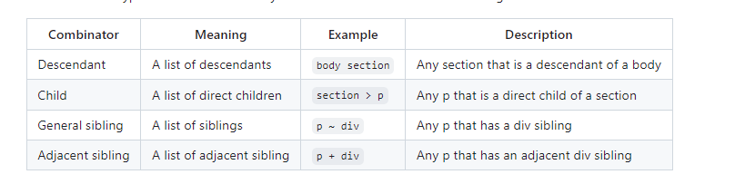
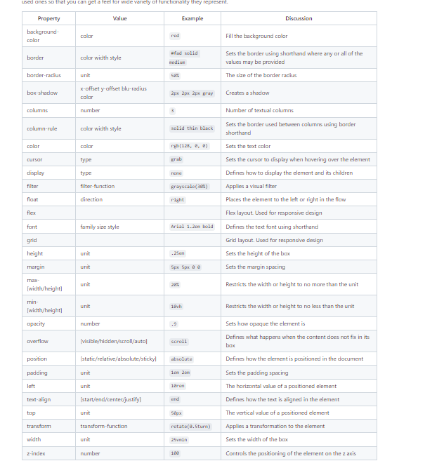
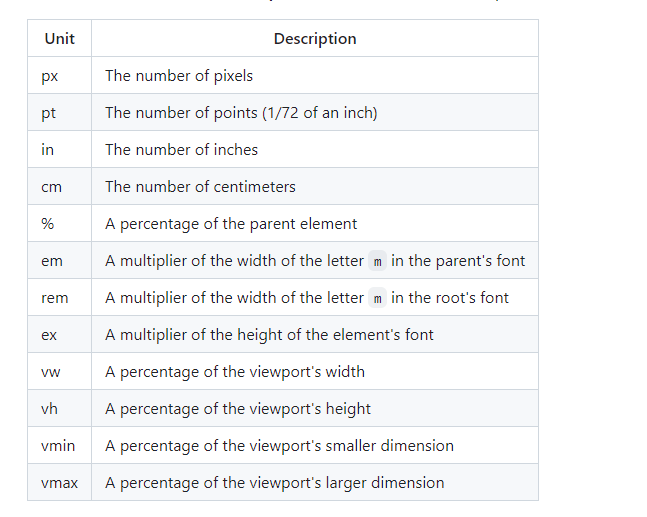
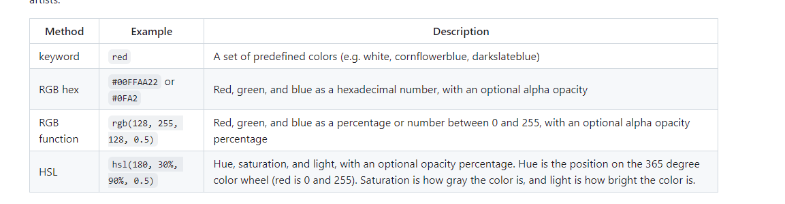

# CSS Notes 
## CSS options 
### HTML directly
```
<p style="color:green">CSS</p>
```
### HTML style element 
```
<head>
  <style>
    p {
      color: green;
    }
  </style>
</head>
<body>
  <p>CSS</p>
</body>
```

### link html with CSS 
```
<link rel="stylesheet" href="styles.css" />
```

## Selectors 

 
 Selector calls:   
 .(name of class)- call a class  
 #(name of id )- call a id  
 attribute selector: Selects a body like p that has a certain attribute example being summary   
 ```
 p[class='summary'] {
  color: red;
}
 ```   
Pseudo selector: select based on positional relations, mouse interactions, hyperlink vestiation, and attributes
```
section:hover {
  border-left: solid 1em purple;
}
``` 
## CSS Declaration



### units 


### Color 


### Fonts 
font-family: (font family name)  - how you change the font   
font-style: italic; - add a style to the font
importing a font: 
```
@font-face {
  font-family: 'Quicksand';
  src: url('https://cs260.click/fonts/quicksand.woff2');
}

p {
  font-family: Quicksand;
}
```

## Animation 

first style the object 
```
p {
  text-align: center;
  font-size: 20vh;

  animation-name: demo;
  animation-duration: 3s;
}
```

Then animate it in a function like thing where the animation name matches the call \
Also you can have a 95% where 95% in it makes the font really big then goes back to 20.

```
@keyframes demo {
  from {
    font-size: 0vh;
  }

  95% {
    font-size: 21vh;
  }

  to {
    font-size: 20vh;
  }
}
```

## Design types 
### Overview 

When writing the code display: these options will come up and whatever you choose it will do as the meaning says. 

## Float: 
Moves a container to the left or right side and allows lines to wrap around.
```
aside {
  float: right;
  padding: 3em;
  margin: 0.5em;
  border: black solid thin;
}
```
Code lets us have a aside area and when we scale the screen down or bigger then the text wraps the area depending on which way you wrote the float if its right then the aside area is on the right and the text is on the left. Note: none does nothing.


## Media query 
dynamically detects the size and orientation of the device and applies CSS rules to represent the structure of the HTML in a way that accommodates the change. A media query takes one or more predicates separated by boolean operators.
```
@media (orientation: portrait) and (max-height: 600px) {
  div {
    transform: rotate(270deg);
  }
}
```
### Another example 
```
@media (orientation: portrait) {
  main {
    flex-direction: column;
  }
}

@media (max-height: 700px) {
  header {
    display: none;
  }
  footer {
    display: none;
  }
}
```

checks if the orientation is a portrait and if the max-height of the size of the window is 600px (x < 600p) if it is then it it rotates the arrow 270 degress. 

```
@media (orientation: portrait) {
  aside {
    display: none;
  }
}
```
## Grid
used to group child elements in a responsive grid.   
display: grid - makes all the children of that element displayed in grid flow.    
grid-template-columns - specifies the layout of the grid columns.   
```
grid-template-columns: repeat(auto-fill, minmax(300px, 1fr));
```
example here: repeatedly define each column to auto fill the parent elements width with children that are resized to a minimum of 300 pixels and a max of one equal fractional unit of grid witdth.    
grid-auto-rows - want all rows to be exactly 300 pixels   
grid-gap - want at least 1 em gap between our grid items.  

```
.container {
  display: grid;
  grid-template-columns: repeat(auto-fill, minmax(300px, 1fr));
  grid-auto-rows: 300px;
  grid-gap: 1em;
}
```

## Flex 
useful when partion application into areas taht responsively move around as the window resizes or the orientation changes.    
Example of flex box for body: 
```
body {
  display: flex;
  flex-direction: column;
  margin: 0;
  height: 100vh;
}
```
header - flex: 0 80px - Zero means it will not grow and 80px means it has a starting basis height of 80 pixels. This creates a fixed size box.  

footer - flex: 0 30px - Like the header it will not grow and has a height of 30 pixels.  
  
main - flex: 1 - One means it will get one fractional unit of growth, and since it is the only child with a non-zero growth value, it will get all the remaining space. Main also gets some additional properties because we want it to also be a flexbox container for the controls and content area. So we set its display to be flex and specify the flex-direction to be row so that the children are oriented side by side.


```
section:nth-child(1) {
  flex: 1;
  background-color: hsl(180, 10%, 80%);
}
section:nth-child(2) {
  flex: 3;
  background-color: white;
}
```
Made this section where it has a total of 4 flex that is divided by sections 

## CSS framework 
Has libraries or presets like bootstrap, tail wind and more. 

## UX design 
Successful websites:  
Design a story 
simplicity 
consistency 
Navigation 


## Misc.

### Meta 
Code tells the website to not scale the page
```
<meta name="viewport" content="width=device-width,initial-scale=1" />
```


