# Java Script Notes 
## Filter and Match Example
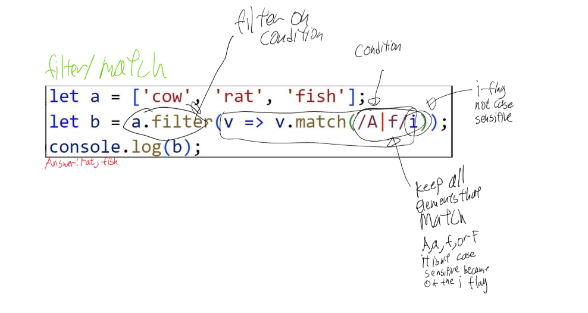

## Promise Example 
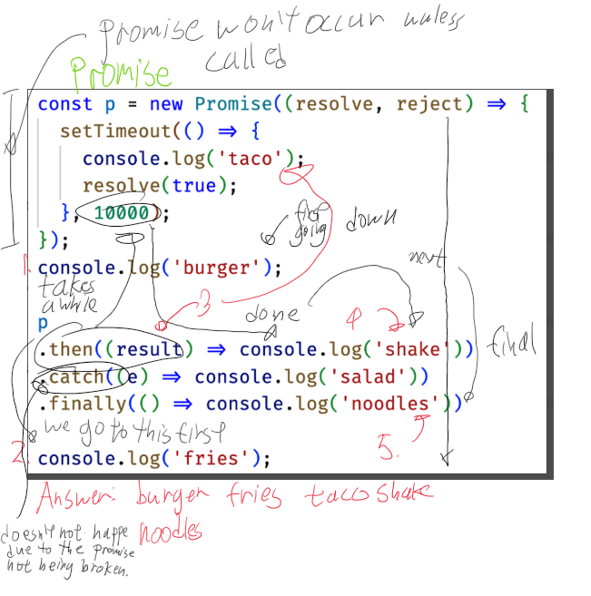

## Reduce and Join 
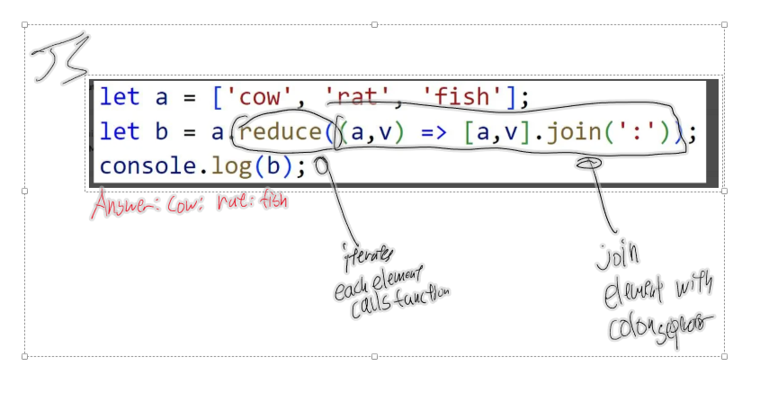

## Map 
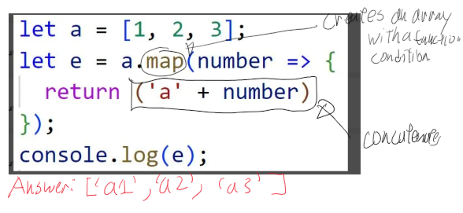

## Function Call
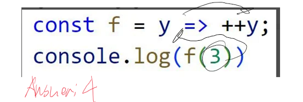

## Async 
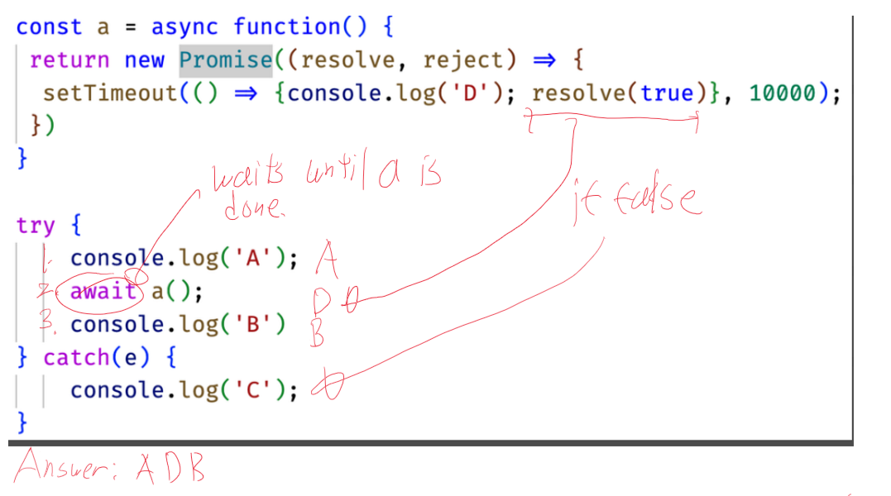

## EventListener 

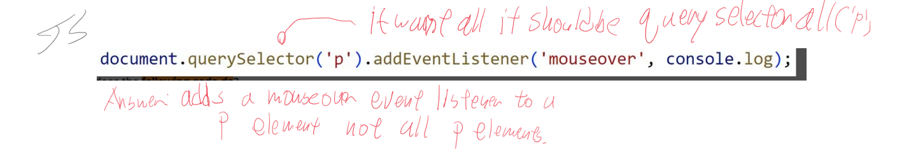


## Console 

### Timers 
```
console.time('demo time');
// ... some code that takes a long time.
console.timeEnd('demo time');
// OUTPUT: demo time: 9762.74 ms
```
Output duration betweeen the time and timeEnd calls 

### Count 
see how many times a block of code is called you can use the count function 
```
console.count('a');
// OUTPUT: a: 1
console.count('a');
// OUTPUT: a: 2
console.count('b');
// OUTPUT: b: 1
```

## Add Java Script to HTML 
Add the script name like this in the head of the html file 
```
<head>
  <script src="javascript.js"></script>
</head>
```

## Types 
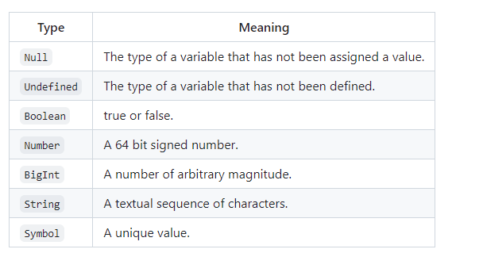
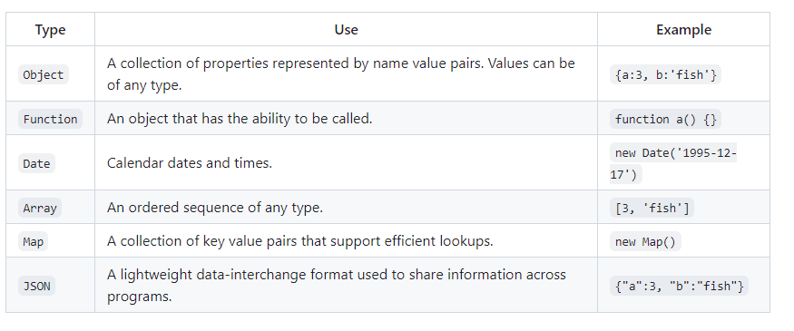

=== (equality).

## Type conversions 

```
2 + '3';
// OUTPUT: '23'
2 * '3';
// OUTPUT: 6
[2] + [3];
// OUTPUT: '23'
true + null;
// OUTPUT: 1
true + undefined;
// OUTPUT: NaN
```
unexpected results :

```
1 == '1';
// OUTPUT: true
null == undefined;
// OUTPUT: true
'' == false;
// OUTPUT: true
1 === '1';
// OUTPUT: false
null === undefined;
// OUTPUT: false
'' === false;
// OUTPUT: false
```


## loops 
### for in 
for in iterates over an objects property names 
```
const obj = { a: 1, b: 'fish' };
for (const name in obj) {
  console.log(name);
}
// OUTPUT: a
// OUTPUT: b
```

### for of 
for of iterates over an iterable array, map, set,... property values 
```
const arr = ['a', 'b'];
for (const val of arr) {
  console.log(val);
}
// OUTPUT: 'a'
// OUTPUT: 'b'
```

### Break and continue 
break or continue sytatement to abort or advance the loop 
```
let i = 0;
while (true) {
  console.log(i);
  if (i === 0) {
    i++;
    continue;
  } else {
    break;
  }
}
// OUTPUT: 0 1
```

## String functions 


## Functions 
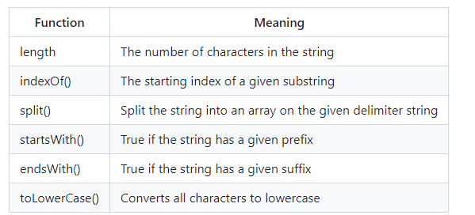

## Anonymous functions

Functions in JavaScript are commonly assigned to a variable so that they can be passed as a parameter to some other function or stored as an object property. To easily support this common use you can define a function anonymously and assign it to a variable.

```
// Function that takes a function as a parameter
function doMath(operation, a, b) {
  return operation(a, b);
}

// Anonymous function assigned to a variable
const add = function (a, b) {
  return a + b;
};

console.log(doMath(add, 5, 3));
// OUTPUT: 8

// Anonymous function assigned to a parameter
console.log(
  doMath(
    function (a, b) {
      return a - b;
    },
    5,
    3
  )
);
// OUTPUT: 2
```


## Inner functions 
Functions can also be declared inside other functions. This allows you to modularize your code without always exposing private details.

```
function labeler(value) {
  function stringLabeler(value) {
    console.log('string=' + value);
  }
  function numberLabeler(value) {
    console.log('number=' + value);
  }

  if (typeof value == 'string') {
    stringLabeler(value);
  } else if (typeof value == 'number') {
    numberLabeler(value);
  }
}

labeler(5);
// OUTPUT: number=5

labeler('fish');
// OUTPUT: string=fish
```

## Arrow functions 
short hand way of writting a function 

```
window.addEventListener(
  'scroll',
  debounce(500, () => {
    console.log('Executed an expensive calculation');
  })
);
```

## Array 

## Functions 
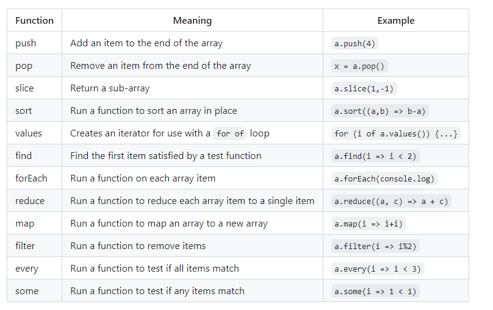
# JSON 
Example of a JSON Document 
```
{
  "class": {
    "title": "web programming",
    "description": "Amazing"
  },
  "enrollment": ["Marco", "Jana", "فَاطِمَة"],
  "start": "2025-02-01",
  "end": null
}
```

## Convert to Java Script 

```
const obj = { a: 2, b: 'crockford', c: undefined };
const json = JSON.stringify(obj);
const objFromJson = JSON.parse(json);

console.log(obj, json, objFromJson);

// OUTPUT:
// {a: 2, b: 'crockford', c: undefined}
// {"a":2, "b":"crockford"}
// {a: 2, b: 'crockford'}
```

## Format 

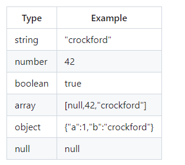

## Regular Expression 
If you are not familiar with regular expressions, you can think of them as textual pattern matchers. You use a regular expression to find text in a string so that you can replace it, or simply to know that it exists.

```
const objRegex = new RegExp('ab*', 'i');
const literalRegex = /ab*/i;
```

### String class usage:

```
const petRegex = /(dog)|(cat)|(bird)/gim;
const text = 'Both cats and dogs are pets, but not rocks.';

text.match(petRegex);
// RETURNS: ['cat', 'dog']

text.replace(petRegex, 'animal');
// RETURNS: Both animals and animals are pets, but not rocks.

petRegex.test(text);
// RETURNS: true
```

## Rest and Spread 
### Rest 
Sometimes you want a function to take an unknown number of parameters. For example, if you wanted to write a function that checks to see if some number in a list is equal to a given number, you could write this using an array.   
Before: 
```
function hasNumber(test, numbers) {
  return numbers.some((i) => i === test);
}

const a = [1, 2, 3];
hasNumber(2, a);
// RETURNS: true
```
After: 
```
function hasTwo(a, b, c) {
  return hasNumber(2, [a, b, c]);
}
```
### Spread 
Spread does the opposite of rest. It take an object that is iterable (e.g. array or string) and expands it into a function's parameters. Consider the following.

```
function person(firstName, lastName) {
  return { first: firstName, last: lastName };
}

const p = person(...['Ryan', 'Dahl']);
console.log(p);
// OUTPUT: {first: 'Ryan', last: 'Dahl'}
```


## Exceptions 
Example: 
```
try {
  // normal execution code
} catch (err) {
  // exception handling code
} finally {
  // always called code
}
```

### Fall back 
Basically if there is an error you can fall back on something 
```
function getScores() {
  try {
    const scores = scoringService.getScores();
    // store the scores so that we can use them later if the network is not available
    window.localStorage.setItem('scores', scores);
    return scores;
  } catch {
    return window.localStorage.getItem('scores');
  }
}
```

## Desctructuring 
Destructuring, not to be confused with destructing, is the process of pulling individual items out of an existing one, or removing structure. You can do this with either arrays or objects. This is helpful when you only care about a few items in the original structure.

## Object and Classes 
### Objects 

```
const obj = {
  a: 3,
  b: 'fish',
};

console.log(Object.entries(obj));
// OUTPUT: [['a', 3], ['b', 'fish']]
console.log(Object.keys(obj));
// OUTPUT: ['a', 'b']
console.log(Object.values(obj));
// OUTPUT: [3, 'fish']
```

### Constructors 
```
function Person(name) {
  return {
    name: name,
  };
}

const p = new Person('Eich');
console.log(p);
// OUTPUT: {name: 'Eich'}
```

### Classes 

```
class Person {
  #name;

  constructor(name) {
    this.#name = name;
  }
}

const p = new Person('Eich');
p.#name = 'Lie';
// OUTPUT: Uncaught SyntaxError: Private field '#name' must be declared in an enclosing class
```

### inheritance 
```
class Person {
  constructor(name) {
    this.name = name;
  }

  print() {
    return 'My name is ' + this.name;
  }
}

class Employee extends Person {
  constructor(name, position) {
    super(name);
    this.position = position;
  }

  print() {
    return super.print() + '. I am a ' + this.position;
  }
}

const e = new Employee('Eich', 'programmer');
console.log(e.print());
// OUTPUT: My name is Eich. I am a programmer
```

## DOM - Document Object Model 

```
function insertChild(parentSelector, text) {
  const newChild = document.createElement('div');
  newChild.textContent = text;

  const parentElement = document.querySelector(parentSelector);
  parentElement.appendChild(newChild);
}

insertChild('#courses', 'new course');
``` 