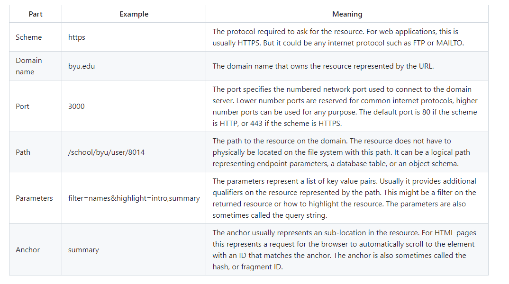
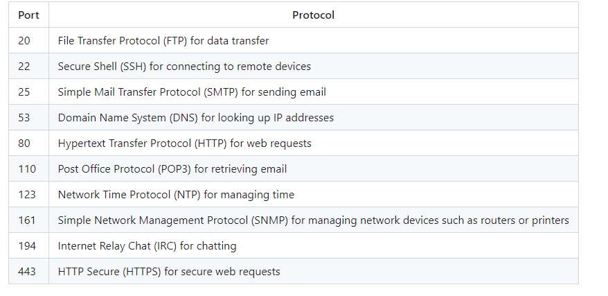
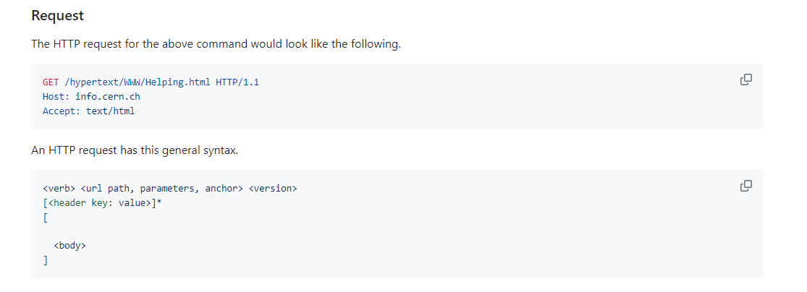
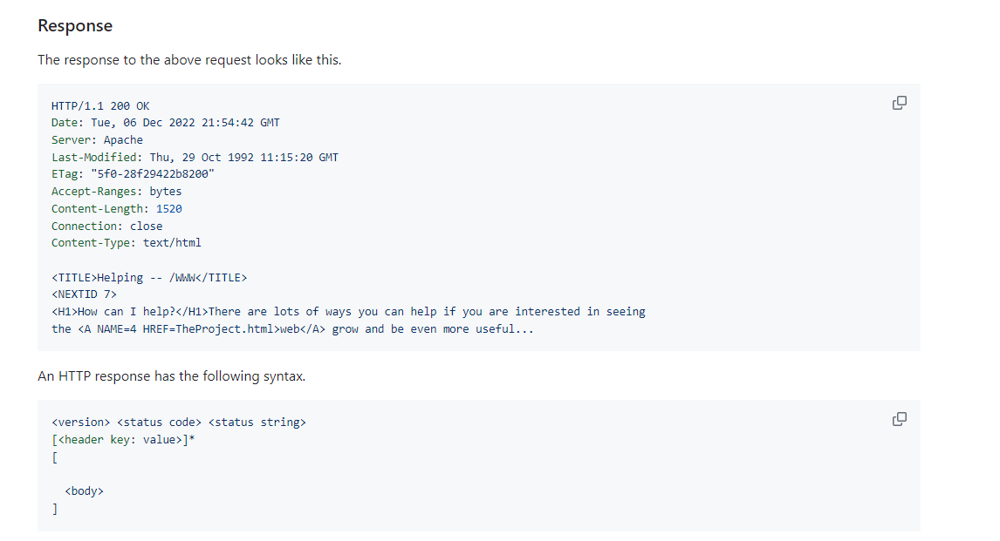
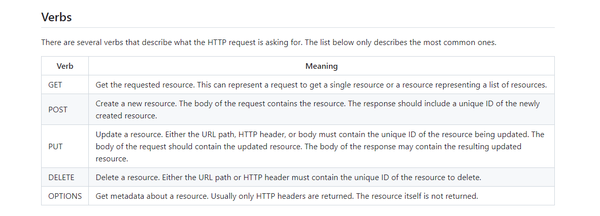
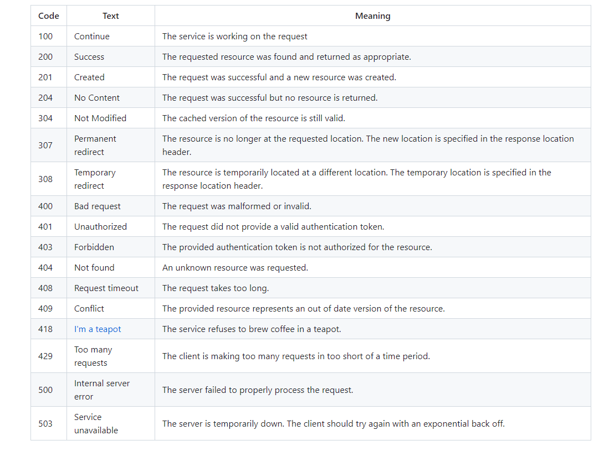
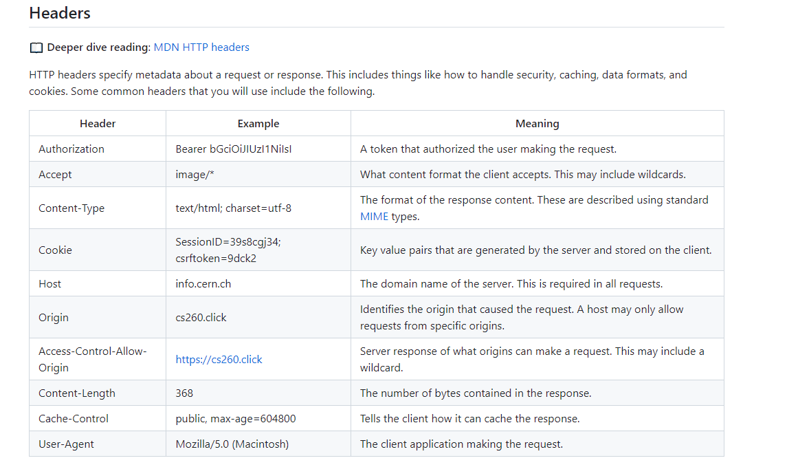

# WebService Notes 
## URL Notes 
The URL syntax uses the following convention. Notice the delimiting punctuation between the parts of the URL. Most parts of the URL are optional. The only ones that are required are the scheme, and the domain name.
```
<scheme>://<domain name>:<port>/<path>?<parameters>#<anchor>
```


## Ports 
-HTTPS port (443) might allow the world to connect
-SSH port (22) might only allow computers at your school
-service defined port (say 3000) may only allow access to processes running on the device.
### Taken Ports:
Ports from 0 to 1023 represent standard protocols. Generally a web service should avoid these ports unless it is providing the protocol represented by the standard.   
### Request entities Ports: 
 Ports from 1024 to 49151 represent ports that have been assigned to requesting entities. 

### Dynamice ports:
 49152 to 65535 are considered dynamic and are used to create dynamic connections to a device

 

 ## HTTP
 HTTP is how the web talks

 ### Requests 
 

The first line of the HTTP request contains the verb of the request, followed by the path, parameters, and anchor of the URL, and finally the version of HTTP being used. The following lines are optional headers that are defined by key value pairs. After the headers you have an optional body. The body start is delimited from the headers with two new lines.

In the above example, we are asking to GET a resource found at the path /hypertext/WWW/Helping.html. The version used by the request is HTTP/1.1. This is followed by two headers. The first specifies the requested host (i.e. domain name). The second specifies what type of resources the client will accept. The resource type is always a MIME type as defined by internet governing body IANA. In this case we are asking for HTML.

 ### Response
 

You can see that the response syntax is similar to the request syntax. The major difference is that the first line represents the version and the status of the response.

Understanding the meaning of the common HTTP verbs, status codes, and headers is important for you to understand, as you will use them in developing a web application. Take some time to internalize the following common values.

 ### Verbs 
 

 ### Status Code

 It is important that you use the standard HTTP status codes in your HTTP responses so that the client of a request can know how to interpret the response. The codes are partitioned into five blocks.

1xx - Informational.  
2xx - Success.   
3xx - Redirect to some other location, or that the previously cached resource is still valid.  
4xx - Client errors. The request is invalid.   
5xx - Server errors. The request cannot be satisfied due to an error on the server.   
 

 ### Headers 
 

 ### Cookies 

 HTTP itself is stateless. This means that one HTTP request does not know anything about a previous or future request. However, that does not mean that a server or client cannot track state across requests. One common method for tracking state is the cookie. Cookies are generated by a server and passed to the client as an HTTP header.  

 The client then caches the cookie and returns it as an HTTP header back to the server on subsequent requests.

 This allows the server to remember things like the language preference of the user, or the user's authentication credentials. A server can also use cookies to track, and share, everything that a user does. However, there is nothing inherently evil about cookies, the problem comes from web applications that use them as a means to violate a user's privacy or inappropriately monetize their data.

 ## SOP and CORS

 ### SOP 
 To combat this problem the Same Origin Policy (SOP) was created. Simply stated SOP only allows JavaScript to make requests to a domain if it is the same domain that the user is currently viewing. 

 EXample:   
  A request from byu.iinstructure.com for service endpoints that are made to byu.instructure.com would fail because the domains do not match. 

  PROBLEM:    
  if you want build a service that any web application can use it would also violate the SOP and fail. In order to address this, the concept of Cross Origin Resource Sharing (CORS) was invented.

### CORS 
CORS allows the client (e.g. browser) to specify the origin of a request and then let the server respond with what origins are allowed   
