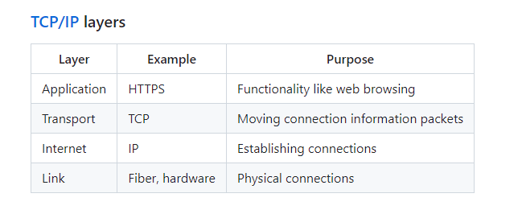

# Web Service Notes
## Layers 

## DNS 
The DNS database records that facilitate the mapping of domain names to IP addresses come in several flavors. The main ones we are concerned with are the address (A) and the canonical name (CNAME) records. An A record is a straight mapping from a domain name to IP address. A CNAME record maps one domain name to another domain name. This acts as a domain name alias. You would use a CNAME to do things like map byu.com to the same IP address as byu.edu so that either one could be used.

## Domain 
Domain- byu.edu
subDomain - c260.cs.byu.edu
edu - TLD
