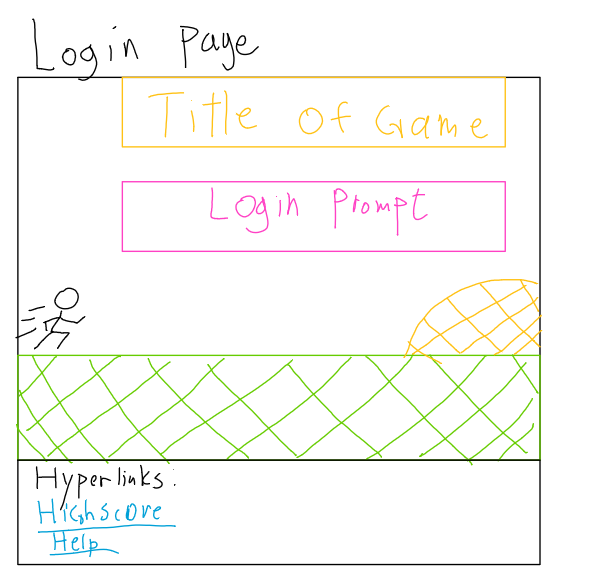
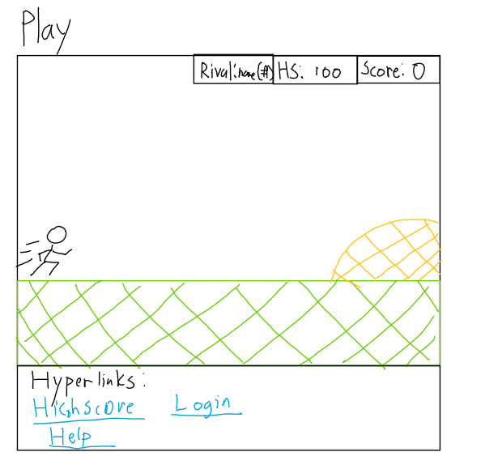

# **Runner**
## **Deliverable specification**
### **Elevator pitch**

Did the internet connection ever go out on your chrome browser and you were stuck without WI-FI playing the dinosaur game as you jump over cacti and under pterodactyls? I know I have and I know many of us have played the game. Well let me tell you I have made a new game that reimagines the same feeling of playing the dinosaur game with color in a vibrant background where you can race against everyone else around the world and have rivals in the game that you try to beat. Why not try it out? 

### **Design**

           

### **Back End Diagram**

 

### **Key features**
	• Secure login over HTTPS 
	• Show score to the world 
	• Play the new and improved dinosaur game
	• Compete with friends 
### **Technologies**
	• HTML- HTML will be used to structure the website pages and create clean layouts 
	• CSS- will be used to create the visuals of the game and make the game vibrant 
	• JavaScript- handle the logic of the login
	• Server- will be the back end 
		○ inputting the high score 
		○ Login
		○ Get high score
		○ Get rivals score 
	• Data base- Store the data 
		○ Store users 
		○ Store high scores 
	• Login- Register and login users. 
	• WebSocket- when run ends you send the data to the database and show where the user is on the leader board 
