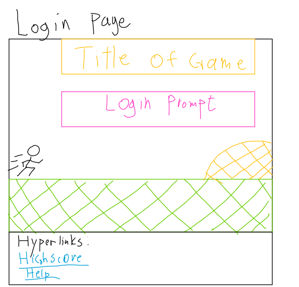
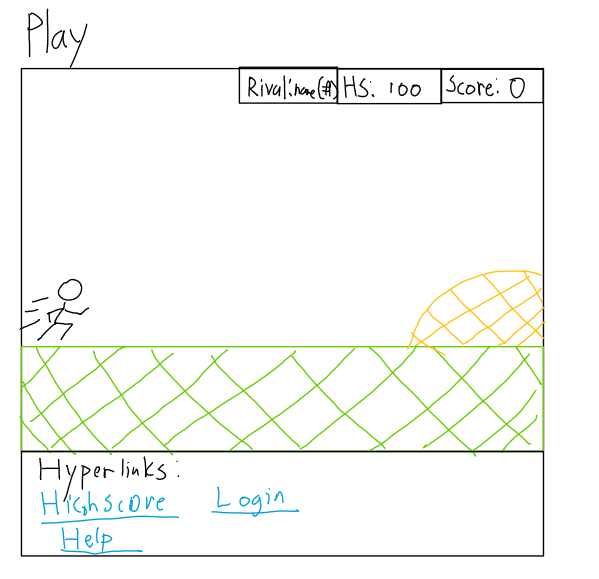
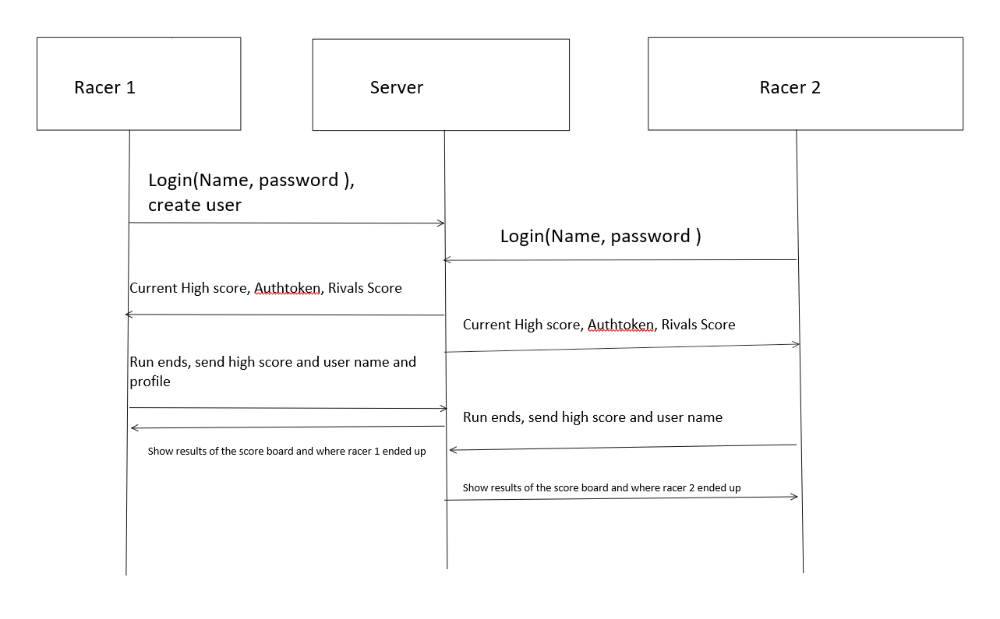

# **Runner**
## **Deliverable specification**
NOTE: All the code for this readme file is in Service folder. 
### **Elevator pitch**
Did the internet connection ever go out on your chrome browser and you were stuck without WI-FI playing the dinosaur game as you jump over cacti and under pterodactyls? I know I have and I know many of us have played the game. Well let me tell you I have made a new game that reimagines the same feeling of playing the dinosaur game with color in a vibrant background where you can race against everyone else around the world and have rivals in the game that you try to beat. Why not try it out? 

### **Design**

           

### **Back End Diagram**

 

### **Key features**
	• Secure login over HTTPS 
	• Show score to the world 
	• Play the new and improved dinosaur game
	• Compete with friends 
### **Technologies**
	• HTML- HTML will be used to structure the website pages and create clean layouts 
	• CSS- will be used to create the visuals of the game and make the game vibrant 
	• JavaScript- handle the logic of the login
	• Server- will be the back end 
		○ inputting the high score 
		○ Login
		○ Get high score
		○ Get rivals score 
	• Data base- Store the data 
		○ Store users 
		○ Store high scores 
	• Login- Register and login users. 
	• WebSocket(communicates back and forth between many computers )- when run ends you send the data to the database and show where the user is on the leader board. Also notifies the user when someone starts playing the game and when they finish you will see what they scored like a notifciation.

## HTML Deliverable
	• HTML Pages-added following pages 
		○ index.html-home page which asks for login
		○ scoreBoard.html- displays the high score board 
		○ game.html-will display the game only placeholders currently
		○ help.html- textually explains the game 
	• Links- github and urls linking all the pages together(wxcept for index to game since I want the user to login or register before playing the game)
	• Text- Added description of the game and control instructions
	• Login - Login layout created 
	• Database- database place holder located in the scoreboard.html where the information will be stored and displayed 
	• WebSocket- websocket place holder located in the game.html for live updates to user. 

## CSS Deliverable
 	• HTML Pages-Formated the below pages
		○ index.html-formatted header/footer/login
		○ scoreBoard.html- formatted header/footer/score board
		○ game.html-formatted header/footer/game layout/ notification texts
		○ help.html- formatted header/footer/image/text
### Java Script Deliverable 
	• For this deliverable I made the dino game playable
		○ login- When you press the submit button it takes you to the game.html page where you play the dino game
		○ database - wrote psudo code for the database implementation that will be done in the future in game.css function addResult and scores.js
		○ WebSocket - wrote psudo code for the websocket implementation as I do not know how it really works in game.css
		○ application logic- dino game is playable where if you press the space bar the dinosaur will jump
### Service Deliverable 
-Node.js/Express HTTP service - done!
-Static middleware for frontend - done!
-Calls to third party endpoints - Not done yet 
-Backend service endpoints - Adds scores to the server array and retrieves them to display scores 
-Frontend calls service endpoints - uses fetch to get data from the server and displays scores on Scoreboard. 

### DB deliverable 
For this deliverable I stored and retrieved data from MongoDB.
-MongoDB Atlas database created - done!
-Endpoints for data - Through the router endpoints I request and get data from the database. 
-Stores data in MongoDB - done!

### Login deliverable 
For this deliverable I added user registration and authentication.
-User registration - Creates a new account in the database.
-existing user - Verifies the user's name and password from data stored in the database
-Use MongoDB to store credentials - finished!
-Restricts functionality - You can't play the game or look at the score board until you log in.