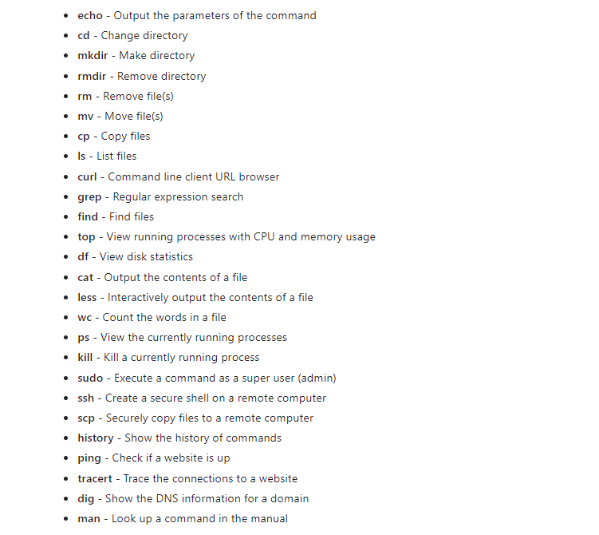
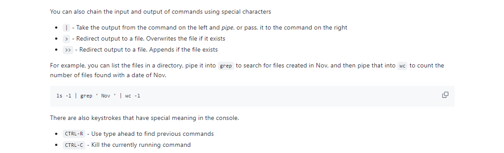

# Github tutorials
## Console commands 




## how to edit github
```
Pull the repository's latest changes from GitHub (git pull)
Make changes to the code
Commit the changes (git commit)
Push the changes to GitHub (git push)
```
## example of push and pull
 ```
➜  git fetch
➜  git status
Your branch is behind 'origin/main' by 1 commit, and can be fast-forwarded.
  (use "git pull" to update your local branch)

➜  git pull
Updating d13a9ce..cafe81a
Fast-forward
 test.md | 4 +++-
 1 file changed, 3 insertions(+), 1 deletion(-)
```

 ## example of push 
 click the source control on left 
 press plus 
 then commit 
 then sync changes 
 ```
 git push
 ```