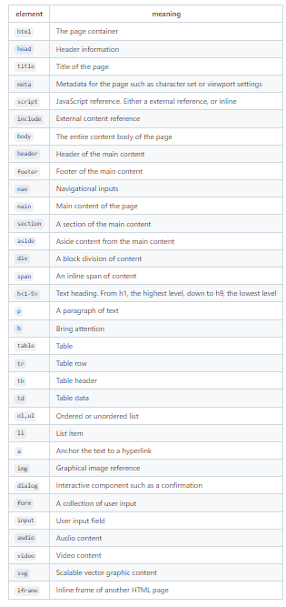
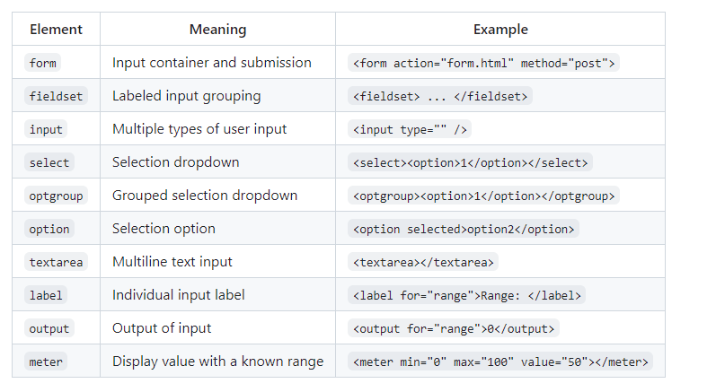

# HTML NOTES 
## Basics of HTML
## Tags and elements 
HTML elements are represented with enclosing tags that may enclose other elements or text. For example, the paragraph element, and its associated tag (p), designate that the text is a structural paragraph of text. When we talk about tags we are referring to a delimited textual name that we use to designate the start and end of an HTML element as it appears in an HTML document. Tags are delimited with the less than (<) and greater than (>) symbols. A closing tag will also have a forward slash (/) before its name.

## Attributes 

Every HTML element may have attributes. Attributes describe the specific details of the element. For example, the id attribute gives a unique ID to the element so that you can distinguish it from other elements. The class attribute is another common element attribute that designates the element as being classified into a named group of elements. Attributes are written inside the element tag with a name followed by an optional value. You can use either single quotes (') or double quotes (") to delimit attribute values.

### Comment Structure 
```
<!-- commented text -->
```
### Special Characters 

HTML uses several reserved characters for defining its file format. If you want to use those characters in your content then you need to escape them using the entity syntax. For example, to display a less than symbol (<) you would instead use the less than entity (&lt;). You can also use the entity syntax to represent any unicode character.


## Table Of All The HTML Elements

### All elements



### Input Elemeents



### Input types 


## Block and Inline

There is a distinction between structure elements that are block vs inline. A block element is meant to be a distinct block in the flow of the content structure. An inline element is meant to be inline with the content flow of a block element. In other words, inline elements do not disrupt the flow of a block element's content. For example, the block element div (division) could have an inline element b in order to bring attention to a portion of its sub-text. Likewise a p (paragraph) element could have a span to mark the paragraph's sub-text as a person's name.

```
<div>He said <b>don't</b> cross the beams.</div>

<p>Authors such as <span>ee cummings</span> often used unconventional structure.</p>
```

## misc facts 
index.html is always the default when the browser opens 
HMTL body has 3 children:  
-header  
-main  
-footer


## example of adding in hyper link 
```
<div><a href="https://byu.edu/" target="_blank">BYU</a> </div>
```
Put in the url without www and also make sure to add target blank here since the code pen does not like it when it takes a person to a site that is not related to code pen

## example of setting color option input 
 ```
 <li>
        <label for="color">Color: </label>
        <input type="color" value="#ff0000" name="varColor" id="color" />
      </li>
 ```
 The value variable is what makes the default color whatever you want it to be 

 ## example of adding in a image to the html
```
<aside>
      <p>Aside</p>
        
    </aside>
```
The site here is what allows you to add the image and should be something found from the web and you just right click the image and copy the image url.


## example of a list 
```
<section>
      <p>Section</p>
      <ul>
        <li>apples</li>
        <li>bananas</li>
        <li>oranges</li>
      </ul>
    </section>
```
## example of a table
```
<section>
      <p>Section</p>
      <table>
        <tr>
          <th>Table</th>
          <th>Table</th>
          <th>Table</th>
        </tr>
        <tr>
          <td>table</td>
          <td>table</td>
          <td>table</td>
        </tr>
        <tr>
          <td>HTML</td>
          <td>CSS</td>
          <td>JavaScript</td>
        </tr>
      </table>
    </section>
```
## example of a header 
```
<h1>Takun Purba</h1>
```
makes text look bigger

## example of a check box 
```
<li>
        <fieldset>
          <legend>checkbox</legend>
          <label for="checkbox1">checkbox1</label>
          <input type="checkbox" id="checkbox1" name="varCheckbox" value="checkbox1" checked />
          <label for="checkbox2">checkbox2</label>
          <input type="checkbox" id="checkbox2" name="varCheckbox" value="checkbox2" />
          <label for="checkbox3">checkbox3</label>
          <input type="checkbox" id="checkbox3" name="varCheckbox" value="checkbox3" />
        </fieldset>
      </li>
```

## example of a radio box 
```
<li>
        <fieldset>
          <legend>radio</legend>
          <label for="radio1">radio1</label>
          <input type="radio" id="radio1" name="varRadio" value="radio1" checked />
          <label for="radio2">radio2</label>
          <input type="radio" id="radio2" name="varRadio" value="radio2" />
          <label for="radio3">radio3</label>
          <input type="radio" id="radio3" name="varRadio" value="radio3" />
        </fieldset>
      </li>
```

## example of a canvas code 

```
<canvas id="canvasDemo" width="300" height="200" style="border: 1px solid #000000"></canvas>
<script>
  const ctx = document.getElementById('canvasDemo').getContext('2d');
  ctx.beginPath();
  ctx.arc(150, 100, 50, 0, 2 * Math.PI);
  ctx.fillStyle = 'red';
  ctx.strokeStyle = 'red';
  ctx.fill();
  ctx.stroke();
</script>
```

## example of video 

```
<video controls width="300" crossorigin="anonymous">
  <source src="https://commondatastorage.googleapis.com/gtv-videos-bucket/sample/BigBuckBunny.mp4" />
</video>
```

## example of SVG

```
<svg viewBox="0 0 300 200" xmlns="http://www.w3.org/2000/svg" stroke="red" fill="red" style="border: 1px solid #000000">
  <circle cx="150" cy="100" r="50" />
</svg>
```


## Example of All of it Together
```
<body>
  <p>Body</p>
  <header>
    <p>Header - <span>Span</span></p>
    <nav>
      Navigation
      <div>Div</div>
      <div>Div</div>
    </nav>
  </header>

  <main>
    <section>
      <p>Section</p>
      <ul>
        <li>List</li>
        <li>List</li>
        <li>List</li>
      </ul>
    </section>
    <section>
      <p>Section</p>
      <table>
        <tr>
          <th>Table</th>
          <th>Table</th>
          <th>Table</th>
        </tr>
        <tr>
          <td>table</td>
          <td>table</td>
          <td>table</td>
        </tr>
      </table>
    </section>
    <aside>
      <p>Aside</p>
    </aside>
  </main>

  <footer>
    <div>Footer - <span>Span</span></div>
  </footer>
</body>
```
### Picture Of The Spacing 

